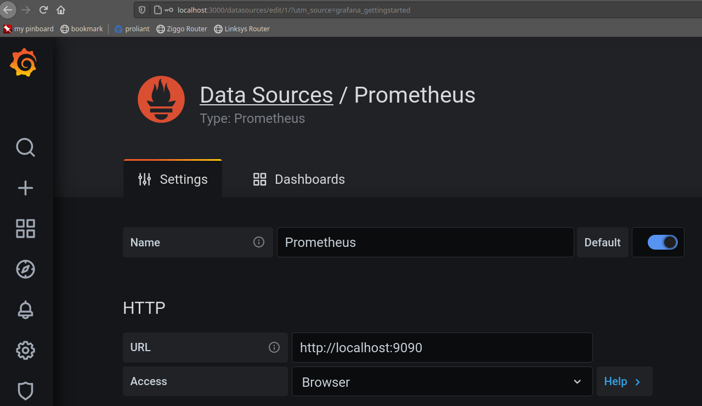

# k8s-df

## Specification

### DF KPI

- Purely based upon K8s deployments (directly via `kubectl deploy`, or indirectly via Helm or CD tooling like ArgoCD)
- 2 parts: K8s controller watching K8s deployments, and exporting frequency as a node exporter for Prometheus
- Per cluster
- Per namespace (*support include/exclude pattern!*)
- Per app (name) (*support include/exclude pattern!*)
- Per aggregate (*support name pattern!*)

## Implementation

### Prerequisites

- Make
- Go 1.14+
- Kubernetes 1.19.1
- [Add client-go as a dependency](https://github.com/jtestard/client-go/blob/master/INSTALL.md#add-client-go-as-a-dependency):

```bash
michael@x250:~/go/src/lttl.dev/k8s-df
$ make init
go mod init
go: creating new go.mod: module lttl.dev/k8s-df
$ make get
go get k8s.io/client-go@v0.19.1
# ...
```

#### Install kind

kind v0.7.0+ is required, but set up was v0.9.0 (which comes with Kubernetes 1.19.1):

```bash
$ curl -Lo ./kind https://kind.sigs.k8s.io/dl/v0.9.0/kind-linux-amd64
$ chmod +x kind
$ mv kind ~/bin
$ kind create cluster
# ...
```

#### Install Prometheus

```bash
$ kubectl create ns monitoring
$ helm repo update
$ helm repo add stable https://charts.helm.sh/stable
$ helm install prometheus stable/prometheus --namespace monitoring
#
# ...
#
# Get the Prometheus server URL by running these commands in the same shell:
#  export POD_NAME=$(kubectl get pods --namespace monitoring -l "app=prometheus,component=server" -o jsonpath="{.items[0].metadata.name}")
#  kubectl --namespace monitoring port-forward $POD_NAME 9090
#
# ...
#
# To uninstall:
#   $ helm delete prometheus --namespace monitoring
#
```

#### Install Grafana

```bash
$ kubectl create ns monitoring
$ helm repo add grafana https://grafana.github.io/helm-charts
$ helm repo update
$ helm install grafana grafana/grafana --namespace monitoring
#
# ...
#
# To uninstall:
#   $ helm delete grafana --namespace monitoring
#
```

#### Configure Prometheus as a Data Source in Grafana



#### Import Prometheus Dashboard in Grafana

Under [Import](http://localhost:3000/dashboard/import) load dashboard ID `1860`.

## Bookmarks

### Major Resources

#### K8s Watcher

- [Building stuff with the Kubernetes API (Part 4) - Using Go](https://medium.com/programming-kubernetes/building-stuff-with-the-kubernetes-api-part-4-using-go-b1d0e3c1c899) and related [pvcwatch in go](https://github.com/vladimirvivien/k8s-client-examples/blob/master/go/pvcwatch/main.go)
- client-go
  - [client-go](https://github.com/kubernetes/client-go)
  - [CUD k8s-deployment in main.go](https://github.com/kubernetes/client-go/blob/master/examples/create-update-delete-deployment/main.go)

#### Prometheus Node Exporter

- [Writing exporters](https://prometheus.io/docs/instrumenting/writing_exporters/)

### K8s API Documentation

- [k8s client-go apps-v1](https://godoc.org/k8s.io/client-go/kubernetes/typed/apps/v1)
- [k8s api-v1](https://godoc.org/k8s.io/api/core/v1)

#### Backlog

- client-go
  - [client-go examples](https://github.com/kubernetes/client-go/tree/master/examples)
  - [Available clientsets](https://github.com/kubernetes/client-go/blob/master/kubernetes/clientset.go)
  - [Deployment informer](https://github.com/kubernetes/client-go/blob/master/informers/apps/v1/deployment.go)
- [Controllers architecture](https://kubernetes.io/docs/concepts/architecture/controller/)
- [Sample controller](https://github.com/kubernetes/sample-controller)
- [A deep dive into Kubernetes controllers](https://engineering.bitnami.com/articles/a-deep-dive-into-kubernetes-controllers.html)
- Kubewatch
  - [Kubewatch, an example of Kubernetes custom controller](https://engineering.bitnami.com/articles/kubewatch-an-example-of-kubernetes-custom-controller.html)
  - [Kubewatch controller.go](https://github.com/bitnami-labs/kubewatch/blob/master/pkg/controller/controller.go)
- [Using Kubernetes API from Go](https://rancher.com/using-kubernetes-api-go-kubecon-2017-session-recap)
- [How to write Kubernetes custom controllers in Go](https://medium.com/speechmatics/how-to-write-kubernetes-custom-controllers-in-go-8014c4a04235)

### Reading List

- [Understanding go.sum and go.mod file in Go (Golang)](https://golangbyexample.com/go-mod-sum-module/)

## Testing

Run a K8s cluster locally.

```bash
# shell 1
$ make all
# ...
$ go run main.go
```

```bash
# shell 2
# deploy ...
$ kubectl create deployment hello-node --image=k8s.gcr.io/echoserver:1.4
# ... delete ...
$ kubectl delete deployment hello-node
# ... deploy
$ kubectl create deployment hello-node --image=k8s.gcr.io/echoserver:1.4
```
