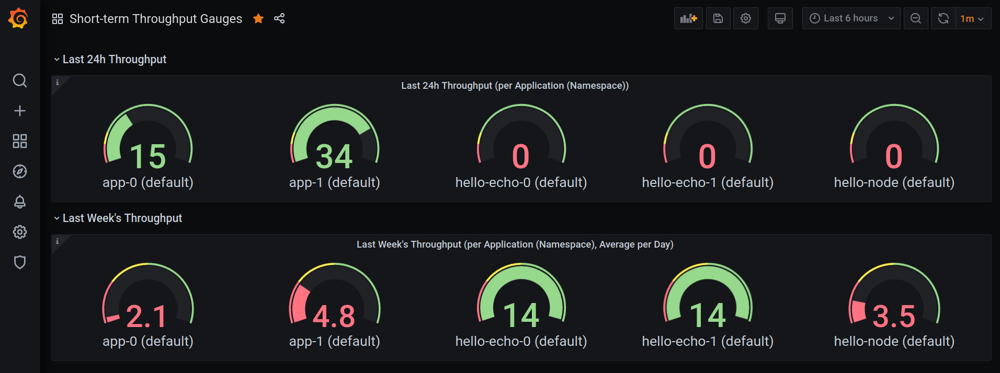

# agility

This is a cloud-native implementation of how to measure agility (read: digital transformation/DevOps transformation) using Kubernetes *Deployment Frequency*.

## Motivation

In their book "[Accelerate - The Science Behind DevOps: Building and Scaling High Performing Technology Organizations](https://itrevolution.com/book/accelerate/)" Forsgren, Humble, and Kim list the following indicators as keys to measure agility:

1. Deployment Frequency (DF) (or Throughput)
2. Change Failure Rate
3. Mean Time to Recover
4. Lead Time (or Cycle Time)

This project addresses the first KPI.

The Deployment Frequency is the amount of deployments (to production) per time period.

As per the [State of DevOps 2019](https://services.google.com/fh/files/misc/state-of-devops-2019.pdf) report, high performing teams deploy 4 times a day. For 2020, in [Data-Driven Benchmarks for High Performing Engineering Teams](https://www.youtube.com/watch?v=iUFpRFvlT2U), CircleCI observed a mean value of 8 deployments per day. This value is used as the main indicator in dashboard gauges below.

By providing an actual implementation to determine and to visualize deployment rates, this project called "agility" contributes to measure and to control a DevOps transformation in an organization.

For more details, see [background](docs/BACKGROUND.md).

All project documentation is [here](docs/).

## Short Version

Although it is highly advised to follow this README in full, here's the short version to get "agility" up and running:

```bash
$ make build # step 1
$ make install # step 2
# this will deploy the built system on Kubernetes
```

Step 3: [Configure](#configure)

Step 4: [Access](#access)

Step 5: [Explore](#explore)

## Specification

### KPI

This project's approach is purely based upon Kubernetes deployments as containerized applications in general and the Kubernetes container orchestrator in particular represent the state of the art. Therefore, IMHO, Kubernetes should be at the heart of an implementation of a digital transformation nowadays.

By watching deployments directly on Kubernetes using its API, any deployment, be it directly via `kubectl deploy`, or indirectly via Helm or CD tooling like ArgoCD, is captured. This makes "agility" agnostic to the deployment tooling or mechanism.

Since this system is deployed as a light-weight container on a cluster, it can also be used in different, separate environments, not only production to give more valuable insights.

Additionally, the *deploymentwatcher* supports deployments per application and per namespace. For both, configurable include/exclude regexp patterns are available.

### Stack

This project is truly cloud-native, it deploys and runs on Kubernetes only. It stores its settings (aforementioned name patterns so far) in a Kubernetes configmap.

Observed Kubernetes deployments are measured and exported using [Prometheus Node Exporter](https://github.com/prometheus/node_exporter). Those measurements are scraped (regularly pulled) by [Prometheus](https://prometheus.io/), the de facto industry standard for monitoring on Kubernetes at the time of writing. Prometheus is not only a monitoring system but also a time series database to collect scraped data.

Another industry standard used here is [Grafana](https://grafana.com/) which facilitates great results illustration, such as deployment rates.

## Realization

### Metric idea

"agility"'s goal is to capture deployment per app and namespace. When it comes to Prometheus Node Exporter and measurements, the specific metric format must be determined. There are at least two options here:

A. `deployed{app=<name>,namespace=<name>}=<UnixTimeOfDeployment>`:

Discussion:

- It's basically the same as the built-in `kube_deployment_created`
- It doesn't capture all counts, only the latest timestamp, i.e. there are missed hits in between scrapes
- It's less intuitive than an increasing count

B. `deployed_count{app=<name>,namespace=<name>}=<numOfDeployments>`:

Discussion:

- It's an atomic count which requires history
- It's conceptually easier to grasp than the `UnixTimeOfDeployment` value approach

Therefore, *option B, `deployed_count`, is the chosen metric format*, but in this project here with an in-memory limitation, i.e. no permanent storage in Prometheus' time series for now. In the long-run, this is neglectable as we're primarily interested in recent agility, keeping values above certain thresholds.

Expressed in [PromQL](https://prometheus.io/docs/prometheus/latest/querying/basics/), the Prometheus Query Language, that means for example:

- Get the increase in number of deployments (for an app), e.g. for the last 24h: `increase(deployed_count[24h])`
- Compute the frequency, e.g. for the last week: `increase(deployed_count[7d])/7`

(The interested reader can find more PromQL examples [here](https://prometheus.io/docs/prometheus/latest/querying/examples/).)

### Design

At its core, "agility" has 3 layers:

1. A Kubernetes Deployments Watcher that is being notified about app installations on the cluster.
2. A "Storage Map" that counts observed app deployments per namespace.
3. A Prometheus Node Exporter that exposes map data.

The following high-level diagram visualizes the architecture more in detail, with the 3 core layers in **bold**:


"agility"'s *deploymentwatcher* and *nodeexporter* run in the same pod. The *deploymentswatcher* settings for app and namespace name patterns are coming from a configmap (being read upon pod start only, i.e. after any change to the settings, the pod must be restarted).

Exported deployment counts end up in Prometheus' data store. While deployment counts and rates can be queried in Prometheus directly, they are also available via dedicated Grafana dashboards. More information about "agility"'s  Prometheus integration and Grafana dashboard setup can be found below.

Last, and most importantly, the end user's access to the KPI measurements illustrated with "agility"'s Grafana dashboards is simply via browser client which is depicted in above's diagram in orange. No fanciness here.

### Prerequisites

Locally, to build and deploy, the following is required:

- Make
- Go 1.14+
- kubectl v1.20.2
- Helm v3.4.2

As far as Kubernetes is concerned:

- [Kubernetes 1.19.1 installed](docs/K8S.md) with [Prometheus and Grafana deployed](docs/MONITORING.md)

## Build

There are two services in this project:

1. a "df-backend" where *deploymentswatcher* and *nodeexporter* reside. It's basically a go binary :-)
2. a "df-frontend" which is a simple API server to provide a liveness and a readiness endpoint for the backend. It's basically a go binary :-)

Both binaries are wrapped up with a Dockerfile. The resulting image can easily be deployed on Kubernetes using the [Helm chart](chart/).

To build the individual services:

### "df-backend"

```bash
cd df-backend # my pwd is ~/go/src/lttl.dev/agility/df-backend
# to invoke all steps individually
$ make init
go mod init
go: creating new go.mod: module lttl.dev/agility/df-backend
$ make get
go get k8s.io/client-go@v0.19.1
# see also https://github.com/jtestard/client-go/blob/master/INSTALL.md#add-client-go-as-a-dependency
$ make build
GOOS=linux GOARCH=amd64 CGO_ENABLED=0 go build -o df-backend
# for full Makefile usage info, run: make
# ...
# or short: make all
```

The outcome of `make` above is the `df-backend` binary.

### "df-frontend"

```bash
cd df-frontend # pwd is ~/go/src/lttl.dev/agility/df-frontend
# to invoke all steps individually
$ make init
# ...
$ make get
# ...
$ make build
# ...
# for full Makefile usage info, run: make
# ...
# or short: make all
```

The outcome of `make` above is the `df-frontend` binary.

### Shortcut

Instead of building both binaries individually, but to compile both services at once and to bake them into a container image, use (and this should be the standard way):

```bash
# from this project directory
$ make build
...
Successfully tagged lttl.dev/agility-df:0.1.0
```

## Install

Finally, to install the previously built image on Kubernetes as follows:

```bash
# uncomment the following if you're using kind to load the image
# $ make load
# from this project directory
$ make install
```

This will deploy "agility" on Kubernetes.

## Configure

To configure the *nodeexporter* in Prometheus, add the following snippet to `prometheus-server`'s Configmap under *scrape_configs*:

```yaml
scrape_configs:
- job_name: 'df_node_exporter_metrics'
  # scrape_interval: 5s # for testing only 
  metrics_path: /metrics
  static_configs:
    - targets:
      - agility-df-backend.agility.svc:8080
  # optional, remove system-generated labels:
  metric_relabel_configs:
    - source_labels: [ job ]
      target_label: job
      action: replace
      replacement: ''
    - source_labels: [ instance ]
      target_label: instance
      action: replace
      replacement: ''
```

Remove the `prometheus-server` pod to force a restart.

## Access

### Import Prometheus Dashboards in Grafana

With aforementioned Kubernetes installation at hand, browse to Grafana (here assumed to be available under [http://localhost:3000](helper/expose-grafana.sh)). Follow Dashboards -> Manage -> [Import](http://localhost:3000/dashboard/import) to upload [these dashboards](grafana-dashboards/).

For thresholds used in gauges, see [background](docs/BACKGROUND.md).

### Optional: Access "df-backend" directly

```bash
# forward local port 8088 to df-frontend port (80), to enable e.g.: curl http://localhost:8088/ready
$ helper/expose-df-frontend.sh
# forward local port 8089 to df-backend (node-exporter) port (8080), to enable: curl localhost:8089/metrics
$ helper/expose-df-backend.sh
```

## Explore

### Optional: Sanity Check

```bash
# run some dummy deployments ...
$ helper/deploy-dummy-apps.sh
```

### Read Measurements

Observe and explore the Grafana dashboards like the following:


