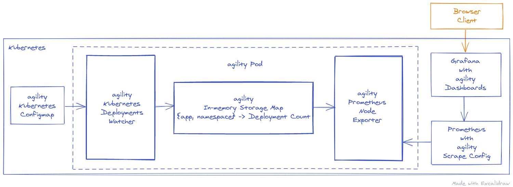

# agility

This is a cloud-native implementation of how to measure agility (read: digital/DevOps transformation) using Kubernetes *Deployment Frequency* KPI.

## Motivation

In their book "[Accelerate - The Science Behind DevOps: Building and Scaling High Performing Technology Organizations](https://itrevolution.com/book/accelerate/)" Forsgren, Humble, and Kim list the following indicators as keys to measure agility:

1. Deployment Frequency (DF) (or Throughput)
2. Change Failure Rate
3. Mean Time to Recover
4. Lead Time (or Cycle Time)

This project addresses the first KPI.

The Deployment Frequency is the amount of deployments (to production) per time period.

As per the [State of DevOps 2019](https://services.google.com/fh/files/misc/state-of-devops-2019.pdf) report, high performing teams deploy 4 times a day. For 2020, in [Data-Driven Benchmarks for High Performing Engineering Teams](https://www.youtube.com/watch?v=iUFpRFvlT2U), CircleCI observed a mean value of 8 deployments per day.

By providing an actual implementation to determine and to visualize deployment rates, this project called "agility" contributes to measure and to control a DevOps transformation in an organization.

## Specification

### KPI

This project's approach is purely based upon Kubernetes deployments as containerized applications in general and the Kubernetes container orchestrator in particular represent the state of the art, and must therefore be the heart of a digital transformation nowadays.

By watching deployments directly on Kubernetes using its API, any deployment, be it directly via `kubectl deploy`, or indirectly via Helm or CD tooling like ArgoCD, is captured.

Since this project's *deploymentwatcher* is deployed as a light-weight container on a cluster, it can also be used in different, separate environments, not only production.

Additionally, the *deploymentwatcher* supports deployments per application and per namespace. For both, configurable include/exclude regexp patterns are available.

### Stack

This project is truly cloud-native, it deploys and runs on Kubernetes only. It stores its settings (aforementioned name patterns so far) in a Kubernetes configmap.

Observed Kubernetes deployments are measured and exported using [Prometheus Node Exporter](https://github.com/prometheus/node_exporter). Those measurements are scraped (regularly pulled) by [Prometheus](https://prometheus.io/), the de facto industry standard for monitoring on Kubernetes at the time of writing. Prometheus is not only a monitoring system but also a time series database to collect scraped data.

Another industry standard used here is [Grafana](https://grafana.com/) which facilitates great results illustration, such as deployment rates.

## Realization

### Metric idea

My goal is to capture deployment per app and namespace. When it comes to Prometheus Node Exporter and measurements, the specific metric format must be determined. There are at least two options here:

1. `deployed{app=<name>,namespace=<name>}=<UnixTimeOfDeployment>`:

Discussion:

- It's basically the same as the built-in `kube_deployment_created`
- It doesn't capture all counts, only the latest timestamp, i.e. there are missed hits in between scrapes
- It's less intuitive than an increasing count

2. `deployed_count{app=<name>,namespace=<name>}=<numOfDeployments>`:

Discussion:

- It's an atomic count which requires history
- It's conceptually easier to grasp than the `UnixTimeOfDeployment` value approach

Therefore, *option 2, `deployed_count`, is the chosen metric format*, but in this project here with an in-memory limitation, i.e. no permanent storage for now. In the long-run, this is neglectable as we're primarily interested in recent agility, keeping values above certain thresholds.

In terms of [PromQL](https://prometheus.io/docs/prometheus/latest/querying/basics/), the Prometheus Query Language, that's e.g.:

- Get the increase in number of deployments (for an app), e.g. for the last 24h: `increase(deployed_count[24h])`
- Compute the frequency, e.g. for the last week: `increase(deployed_count[7d])/7`

(The interested reader can find more PromQL Query examples [here](https://prometheus.io/docs/prometheus/latest/querying/examples/).)

### Design

At its core, "agility" has 3 layers:

1. A Kubernetes Deployments Watcher that is being notified about app installations on the cluster.
2. A "Storage Map" that obtains observed app installations per namespace. Stored values are counted.
3. A Prometheus Node Exporter that exposes storage map data.

The following high-level diagram visualizes the architecture more in detail:


agility's *deploymentwatcher* and *nodeexporter* run in the same pod. The *deploymentswatcher* settings for app and namespace name patterns are coming from a configmap (being read upon pod start only, i.e. after any change to the settings, the pod must be restarted).

Exported deployment counts end up in Prometheus' data store. While deployment counts and rates can be queried in Prometheus directly, they are also available via dedicated Grafana dashboards. More information about "agility"'s  Prometheus integration and Grafana dashboard setup can be found below.

Last, and most importantly, the end user's access to the KPI measurements illustrated with "agility"'s Grafana dashboards is simply via browser client. No fanciness here.

### Prerequisites

Locally, to build and deploy, the following is required:

- Make
- Go 1.14+
- kubectl v1.20.2
- Helm v3.4.2

As far as Kubernetes is concerned:

- [Kubernetes 1.19.1 installed](docs/K8S.md) with [Prometheus and Grafana deployed](docs/MONITORING.md)

## Import Prometheus Dashboard in Grafana

Under Grafana -> Dashboards -> Manage -> [Import](http://localhost:3000/dashboard/import) (assumes Grafana to be available under [http://localhost:3000](helper/expose-grafana.sh)):

- Upload [these dashboards](grafana-dashboards/)
- Optional: load dashboard ID `1860`

## Build

### deployments watcher

- [Add client-go as a dependency](https://github.com/jtestard/client-go/blob/master/INSTALL.md#add-client-go-as-a-dependency):

```bash
# pwd is ~/go/src/lttl.dev/agility/deployments-watcher
$ make init
go mod init
go: creating new go.mod: module lttl.dev/agility/deployments-watcher
$ make get
go get k8s.io/client-go@v0.19.1
# ...
```

## Bookmarks

### Major Resources

#### K8s

Watcher:

- [Building stuff with the Kubernetes API (Part 4) - Using Go](https://medium.com/programming-kubernetes/building-stuff-with-the-kubernetes-api-part-4-using-go-b1d0e3c1c899) and related [pvcwatch in go](https://github.com/vladimirvivien/k8s-client-examples/blob/master/go/pvcwatch/main.go)
- client-go
  - [client-go](https://github.com/kubernetes/client-go)
  - [CUD k8s-deployment in main.go](https://github.com/kubernetes/client-go/blob/master/examples/create-update-delete-deployment/main.go)

ConfigMap:

- [K8S Read config map via go API](https://stackoverflow.com/questions/59234194/k8s-read-config-map-via-go-api)
- [A simple Go client for Kubernetes](https://github.com/ericchiang/k8s#a-simple-go-client-for-kubernetes)

#### Prometheus Node Exporter

- [Writing exporters](https://prometheus.io/docs/instrumenting/writing_exporters/)
- [Naming conventions](https://prometheus.io/docs/practices/naming/)
- [Best practices](https://prometheus.io/docs/practices/instrumentation/#things-to-watch-out-for)
- [A Noob's Guide to Custom Prometheus Exporters](https://rsmitty.github.io/Prometheus-Exporters/)
- [A Noob's Guide to Custom Prometheus Exporters (Revamped!)](https://rsmitty.github.io/Prometheus-Exporters-Revamp/)
- [Prometheus' node_exporter.go](https://github.com/prometheus/node_exporter/blob/master/node_exporter.go)
- [Scheduling](https://prometheus.io/docs/instrumenting/writing_exporters/#scheduling): "*Metrics should only be pulled from the application when Prometheus scrapes them, exporters should not perform scrapes based on their own timers. That is, all scrapes should be synchronous.*"

#### Kind

- kind: [Loading an Image Into Your Cluster](https://kind.sigs.k8s.io/docs/user/quick-start/#loading-an-image-into-your-cluster)

### K8s API Documentation

- [k8s client-go apps-v1](https://godoc.org/k8s.io/client-go/kubernetes/typed/apps/v1)
- [k8s api-v1](https://godoc.org/k8s.io/api/core/v1)

#### Backlog

- client-go
  - [client-go examples](https://github.com/kubernetes/client-go/tree/master/examples)
  - [Available clientsets](https://github.com/kubernetes/client-go/blob/master/kubernetes/clientset.go)
  - [Deployment informer](https://github.com/kubernetes/client-go/blob/master/informers/apps/v1/deployment.go)
- [Controllers architecture](https://kubernetes.io/docs/concepts/architecture/controller/)
- [Sample controller](https://github.com/kubernetes/sample-controller)
- [A deep dive into Kubernetes controllers](https://engineering.bitnami.com/articles/a-deep-dive-into-kubernetes-controllers.html)
- Kubewatch
  - [Kubewatch, an example of Kubernetes custom controller](https://engineering.bitnami.com/articles/kubewatch-an-example-of-kubernetes-custom-controller.html)
  - [Kubewatch controller.go](https://github.com/bitnami-labs/kubewatch/blob/master/pkg/controller/controller.go)
- [Using Kubernetes API from Go](https://rancher.com/using-kubernetes-api-go-kubecon-2017-session-recap)
- [How to write Kubernetes custom controllers in Go](https://medium.com/speechmatics/how-to-write-kubernetes-custom-controllers-in-go-8014c4a04235)

## Deployment

```bash
# from this project directory
$ make install
```

## Access

```bash
# forward local port 8088 to df-frontend port (80), to enable: curl localhost:8088
$ helper/expose-df-frontend.sh
# forward local port 8089 to df-backend (node-exporter) port (8080), to enable: curl localhost:8089/metrics
$ helper/expose-df-backend.sh
```

## Configure DF Node Exporter in Prometheus

Add the following snippet to `prometheus-server`'s Configmap under *scrape_configs*:

```yaml
scrape_configs:
- job_name: 'df_node_exporter_metrics'
  scrape_interval: 5s # for testing only
  metrics_path: /metrics
  static_configs:
    - targets:
      - agility-df-backend.agility.svc:8080
  # optional, remove system-generated labels:
  metric_relabel_configs:
    - source_labels: [ job ]
      target_label: job
      action: replace
      replacement: ''
    - source_labels: [ instance ]
      target_label: instance
      action: replace
      replacement: ''
```

Remove the `prometheus-server` pod to force a restart.

## Testing

Run a K8s cluster locally.

```bash
# shell 1
$ make all
# ...
$ go run main.go
```

```bash
# shell 2
# run some dummy deployments ...
$ helper/deploy-dummy-apps.sh
```

## Troubleshooting

### Helm

```bash
# from this project folder
$ helm install --namespace agility --debug --dry-run agility ./chart
```
