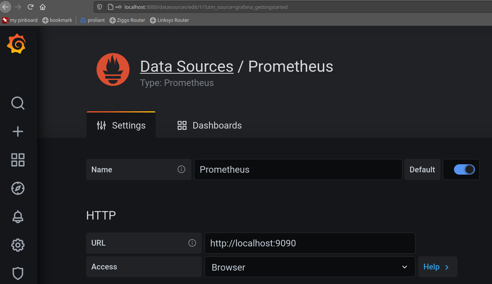

# Monitoring

This is a small recap how to install Prometheus and Grafana using Helm charts.

My setup for this project was Kubernetes 1.19.1 (a kind cluster) with the following monitoring stack deployed in the namespace `monitoring`:
  
| app name | chart version | app version |
| --- | --- | --- |
| grafana | grafana-6.1.17 | 7.3.5 |
| prometheus | prometheus-11.12.1 | 2.20.1 |

## Prometheus

```bash
$ kubectl create ns monitoring
$ helm repo update
$ helm repo add stable https://charts.helm.sh/stable
$ helm install prometheus stable/prometheus --namespace monitoring
#
# ...
#
# Get the Prometheus server URL by running these commands in the same shell:
#  export POD_NAME=$(kubectl get pods --namespace monitoring -l "app=prometheus,component=server" -o jsonpath="{.items[0].metadata.name}")
#  kubectl --namespace monitoring port-forward $POD_NAME 9090
#
# ...
#
# To uninstall:
#   $ helm delete prometheus --namespace monitoring
#
```

See also [expose-prometheus.sh](../helper/expose-prometheus.sh) to make Grafana available under [http://localhost:9090](http://localhost:9090).

## Grafana

```bash
$ kubectl create ns monitoring # should have been created in the previous step
$ helm repo add grafana https://grafana.github.io/helm-charts
$ helm repo update
$ helm install grafana grafana/grafana --namespace monitoring
#
# ...
#
# To uninstall:
#   $ helm delete grafana --namespace monitoring
#
```

Get the Grafana URL by running these commands in the same shell:

```bash
# get the initial admin password:
$ kubectl get secret --namespace monitoring grafana -o jsonpath="{.data.admin-password}" | base64 --decode ; echo
$ export POD_NAME=$(kubectl get pods --namespace monitoring -l "app.kubernetes.io/name=grafana,app.kubernetes.io/instance=grafana" -o jsonpath="{.items[0].metadata.name}")
$ kubectl --namespace monitoring port-forward $POD_NAME 3000
# browse to localhost:3000
```

See also [expose-grafana.sh](../helper/expose-grafana.sh) to make Grafana available under [http://localhost:3000](http://localhost:3000).

## Configure Prometheus as a Data Source in Grafana


